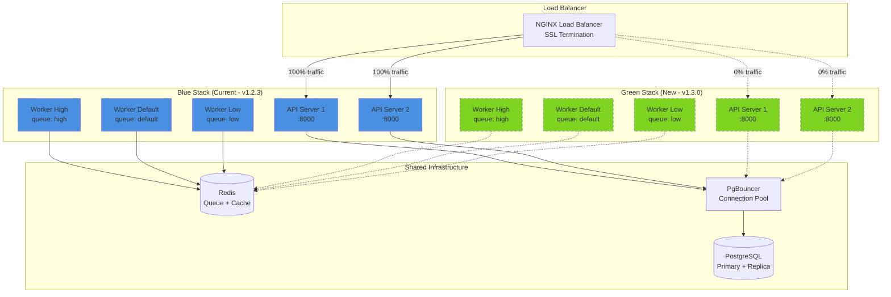
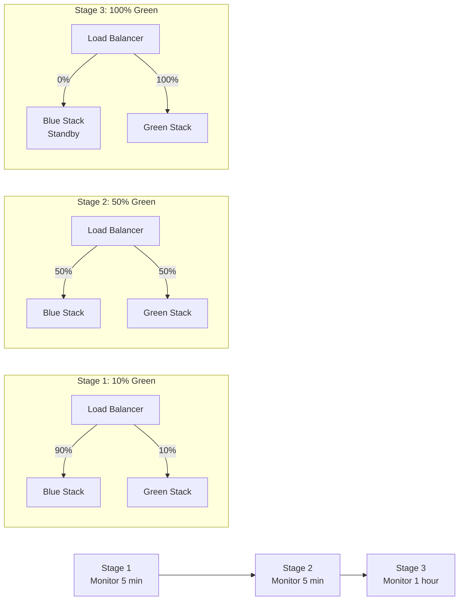
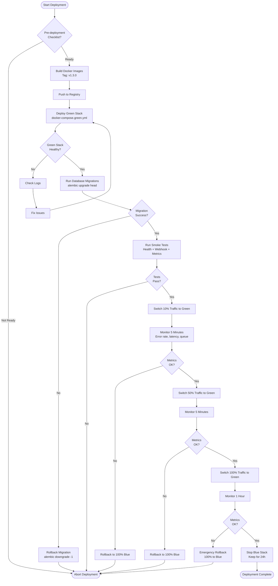
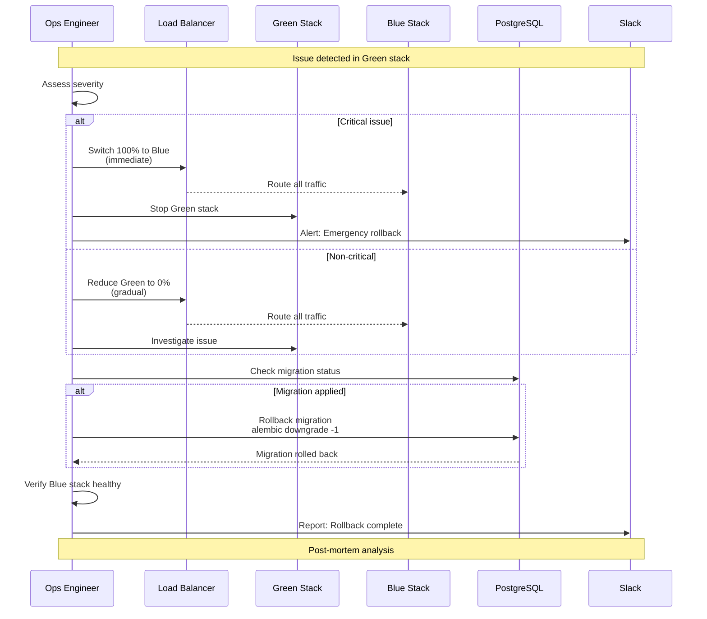
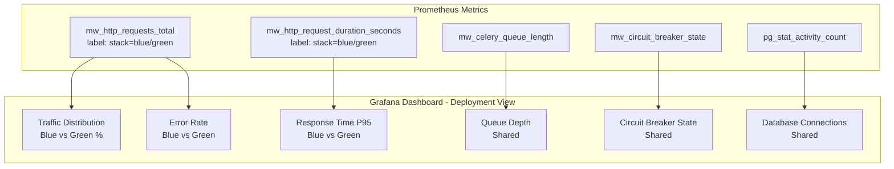
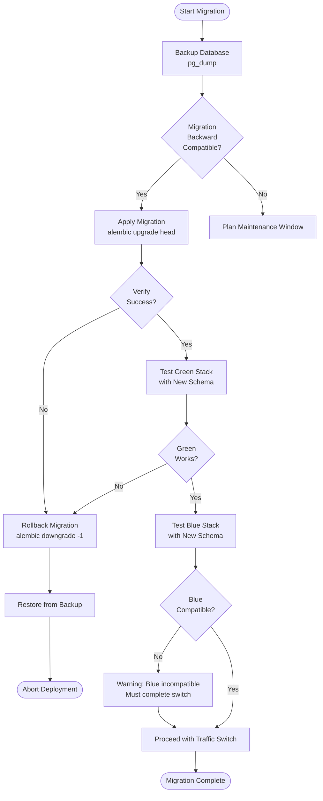

# Blue-Green Deployment Diagram

## Deployment Architecture



## Deployment Timeline

```mermaid
gantt
    title Blue-Green Deployment Timeline
    dateFormat HH:mm
    axisFormat %H:%M

    section Preparation
    Build & push images     :done, prep1, 14:00, 10m
    Deploy green stack      :done, prep2, 14:10, 5m
    Run migrations          :done, prep3, 14:15, 3m
    Smoke tests             :done, prep4, 14:18, 5m

    section Traffic Switch
    10% to green            :active, switch1, 14:23, 5m
    Monitor metrics         :active, mon1, 14:23, 5m
    50% to green            :active, switch2, 14:28, 5m
    Monitor metrics         :active, mon2, 14:28, 5m
    100% to green           :active, switch3, 14:33, 2m

    section Verification
    Post-deploy checks      :active, verify, 14:35, 10m
    Monitor for 1 hour      :crit, monitor, 14:45, 60m

    section Cleanup
    Stop blue stack         :cleanup, 15:45, 5m
    Remove after 24h        :milestone, 15:50, 0m
```



## Traffic Switch Stages



## Deployment Flow



## NGINX Configuration

### Initial State (100% Blue)

```nginx
upstream backend {
    server blue-api-1:8000 weight=100;
    server blue-api-2:8000 weight=100;
    server green-api-1:8000 weight=0;
    server green-api-2:8000 weight=0;
}
```

### Stage 1 (10% Green)

```nginx
upstream backend {
    server blue-api-1:8000 weight=90;
    server blue-api-2:8000 weight=90;
    server green-api-1:8000 weight=10;
    server green-api-2:8000 weight=10;
}
```

### Stage 2 (50% Green)

```nginx
upstream backend {
    server blue-api-1:8000 weight=50;
    server blue-api-2:8000 weight=50;
    server green-api-1:8000 weight=50;
    server green-api-2:8000 weight=50;
}
```

### Stage 3 (100% Green)

```nginx
upstream backend {
    server blue-api-1:8000 weight=0;
    server blue-api-2:8000 weight=0;
    server green-api-1:8000 weight=100;
    server green-api-2:8000 weight=100;
}
```

## Rollback Procedure



## Monitoring Dashboard



## Database Migration Strategy



## Zero-Downtime Checklist

- [ ] **Database migrations are backward compatible**
  - Old code (Blue) can read new schema
  - New code (Green) can read old schema

- [ ] **API changes are backward compatible**
  - No breaking changes to webhook endpoints
  - No breaking changes to admin API

- [ ] **Feature flags enabled**
  - New features behind flags
  - Can disable if issues detected

- [ ] **Monitoring in place**
  - Grafana dashboard ready
  - Alert rules configured
  - Slack notifications working

- [ ] **Rollback plan documented**
  - NGINX config rollback steps
  - Database migration rollback steps
  - Emergency contact list

- [ ] **Load testing completed**
  - Green stack tested under load
  - Performance comparable to Blue

- [ ] **On-call engineer available**
  - During deployment window
  - For 1 hour post-deployment

## Best Practices

1. **Gradual Traffic Switch**
   - Start with 10% to detect issues early
   - Monitor each stage for 5 minutes minimum
   - Abort if any metric degrades

2. **Keep Blue Running**
   - Don't stop Blue for 1 hour after 100% switch
   - Keep for 24 hours for emergency rollback
   - Only remove after confidence period

3. **Database Migrations**
   - Always backward compatible
   - Test with both Blue and Green
   - Have rollback script ready

4. **Monitoring**
   - Watch error rate, latency, queue depth
   - Compare Blue vs Green metrics
   - Alert on any anomaly

5. **Communication**
   - Notify team before deployment
   - Update status in Slack
   - Document any issues encountered
