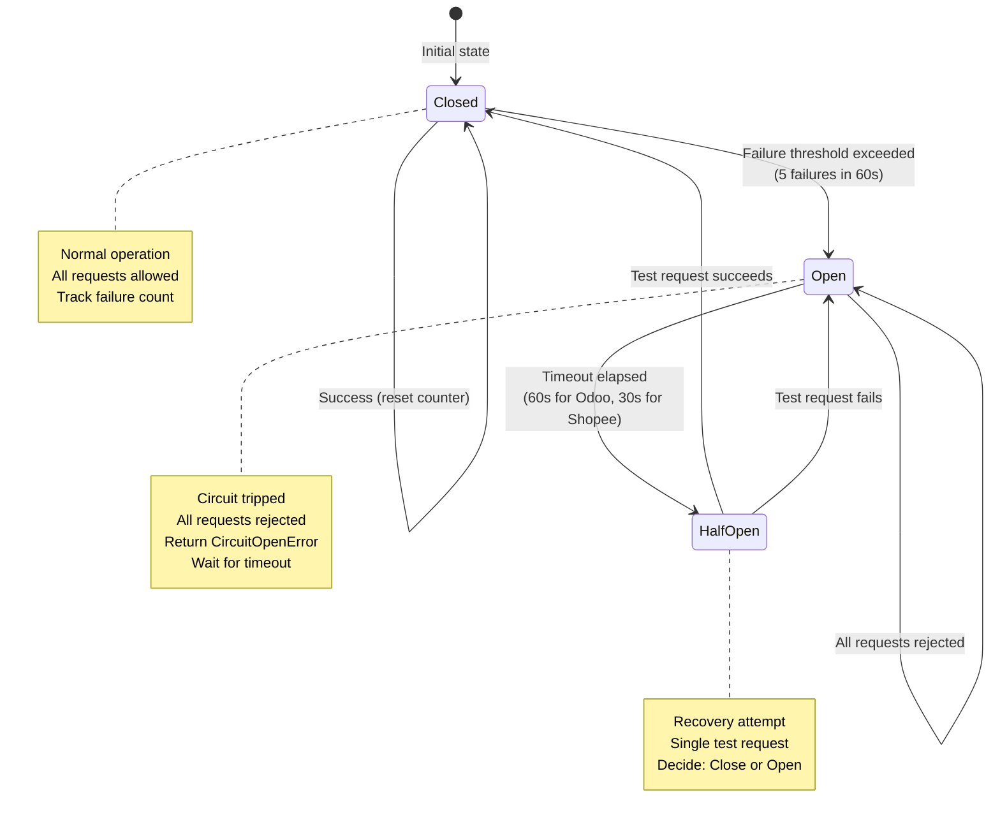
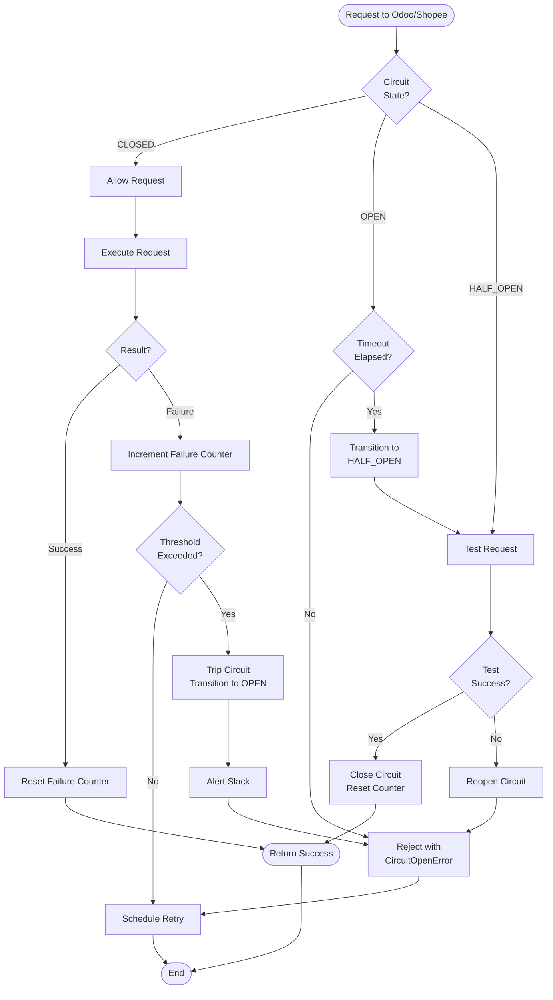
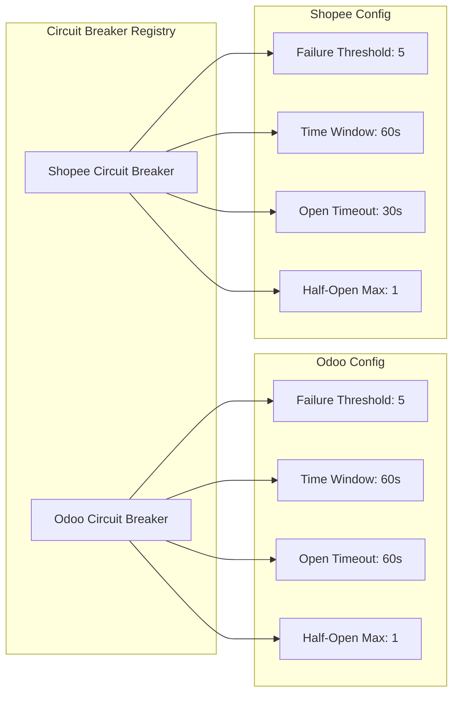
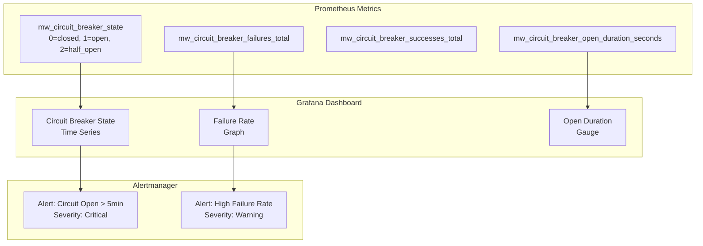
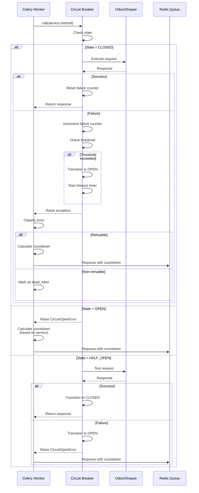

# Circuit Breaker State Diagram

## State Machine

## Detailed Flow

## Configuration

## Metrics & Monitoring

## Worker Retry Logic

## Recovery Scenarios

### Scenario 1: Odoo Database Maintenance

```mermaid
gantt
    title Odoo Maintenance - Circuit Breaker Behavior
    dateFormat HH:mm
    axisFormat %H:%M

    section Circuit State
    CLOSED           :done, closed1, 14:00, 5m
    OPEN (tripped)   :crit, open1, 14:05, 10m
    HALF_OPEN (test) :active, half1, 14:15, 1m
    CLOSED (recovered):done, closed2, 14:16, 14m

    section Odoo Status
    Online           :done, online1, 14:00, 5m
    Maintenance      :crit, maint, 14:05, 10m
    Online           :done, online2, 14:15, 15m

    section Worker Behavior
    Normal processing:done, work1, 14:00, 5m
    Requests rejected:crit, reject, 14:05, 10m
    Test request     :active, test, 14:15, 1m
    Normal processing:done, work2, 14:16, 14m
```

### Scenario 2: Network Partition

```mermaid
gantt
    title Network Partition - Multiple Open/Close Cycles
    dateFormat HH:mm
    axisFormat %H:%M

    section Circuit State
    CLOSED           :done, c1, 10:00, 3m
    OPEN             :crit, o1, 10:03, 1m
    HALF_OPEN        :active, h1, 10:04, 1m
    OPEN             :crit, o2, 10:05, 1m
    HALF_OPEN        :active, h2, 10:06, 1m
    CLOSED           :done, c2, 10:07, 23m

    section Network
    Stable           :done, n1, 10:00, 3m
    Flapping         :crit, flap, 10:03, 4m
    Stable           :done, n2, 10:07, 23m
```

## Best Practices

1. **Failure Threshold**
   - Set based on service SLA
   - Odoo: 5 failures (higher tolerance)
   - Shopee: 5 failures (API rate limits)

2. **Timeout Duration**
   - Odoo: 60s (database recovery time)
   - Shopee: 30s (faster API recovery)

3. **Half-Open Strategy**
   - Single test request only
   - Fail fast if test fails
   - Immediate close if test succeeds

4. **Monitoring**
   - Alert if circuit open > 5 minutes
   - Track open/close frequency
   - Correlate with service health

5. **Worker Retry**
   - Use circuit-aware countdown
   - Don't retry immediately on CircuitOpenError
   - Respect service-specific backoff
