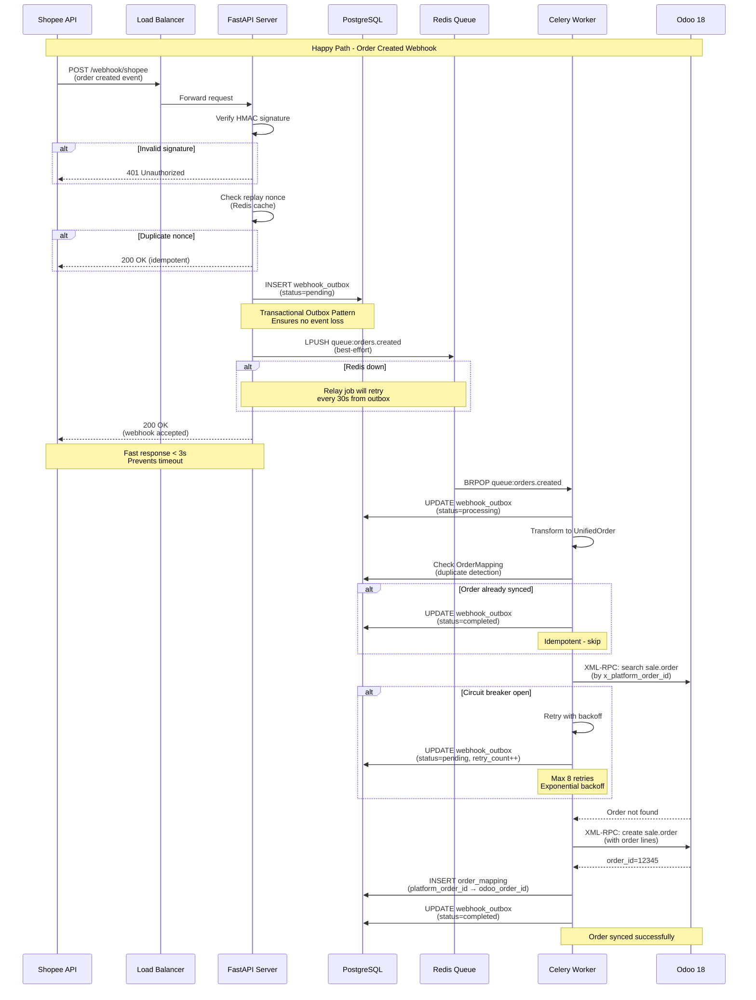
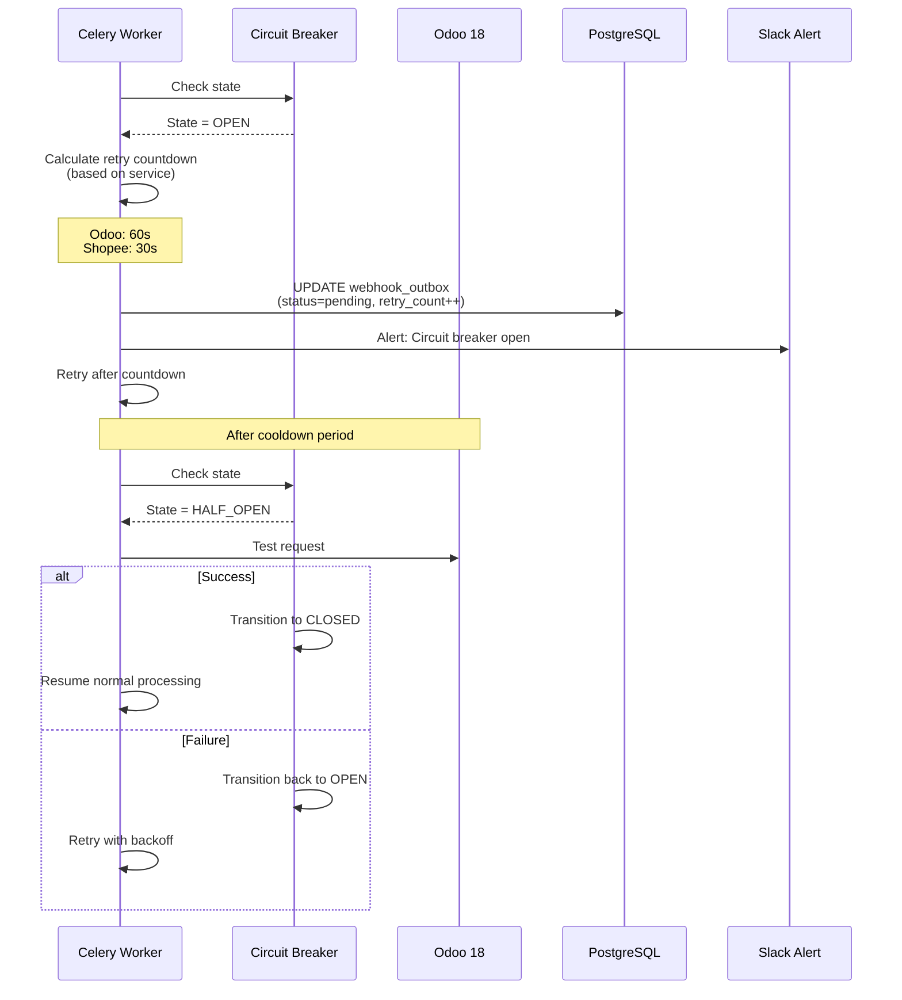
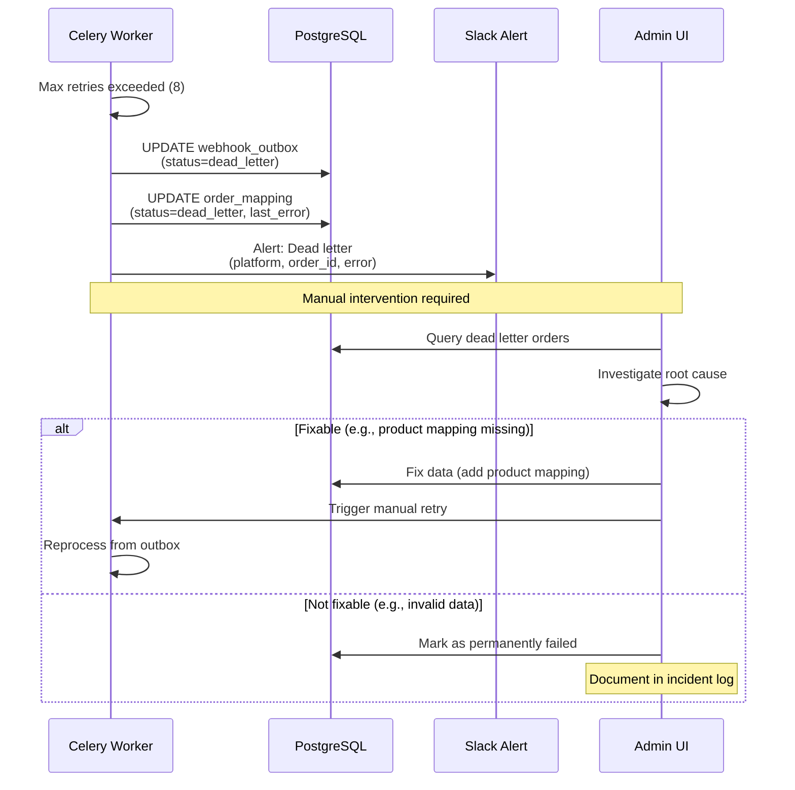
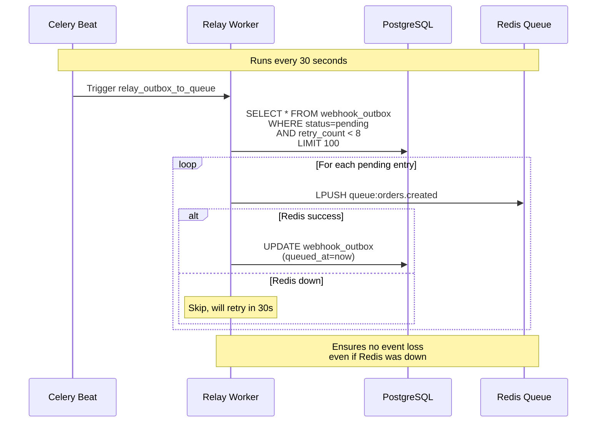
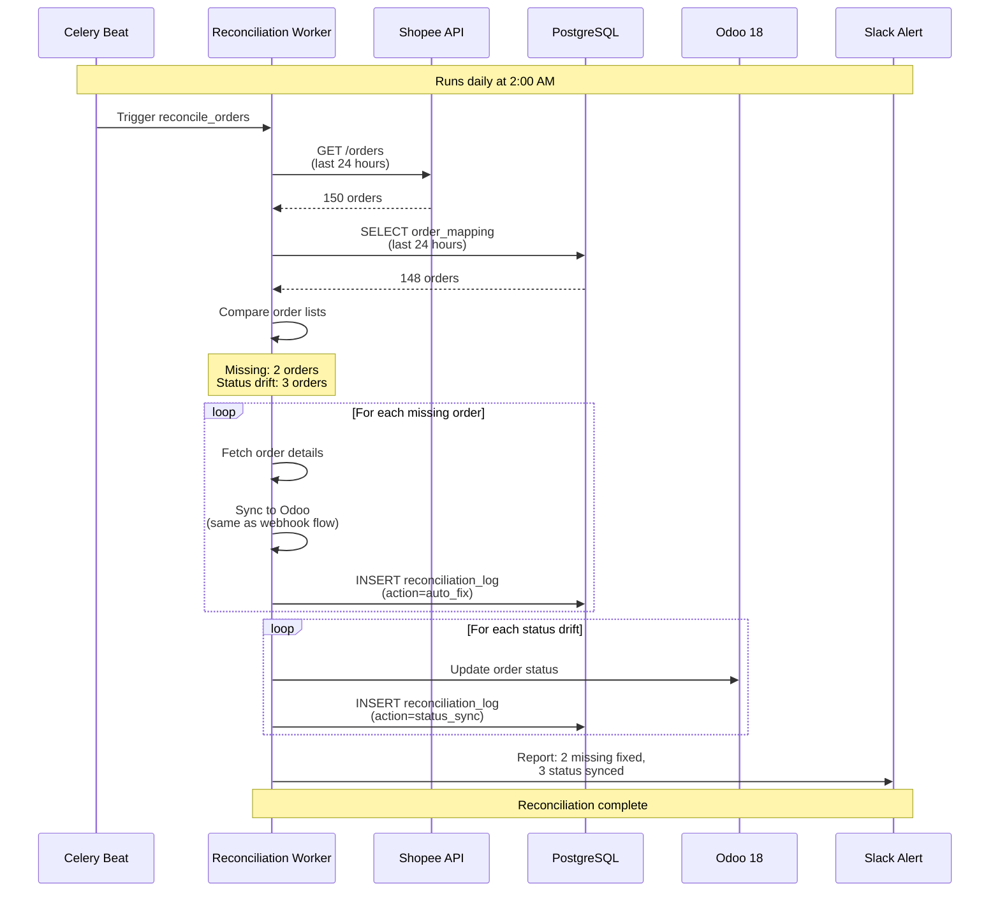

# Webhook Flow Diagram

## Overview
This diagram shows the complete flow from receiving a webhook from Shopee to syncing the order in Odoo.

## Error Handling Flows

### Circuit Breaker Open

### Dead Letter Handling

## Outbox Relay Job

## Reconciliation Flow

## Key Design Principles

1. **Transactional Outbox Pattern**
   - Webhook saved to PostgreSQL BEFORE Redis push
   - Guarantees no event loss even if Redis is down
   - Relay job ensures eventual delivery

2. **Idempotency**
   - Replay nonce check (Redis cache, 5 min TTL)
   - OrderMapping duplicate detection
   - Safe to retry any operation

3. **Circuit Breaker**
   - Protects Odoo from cascading failures
   - Automatic recovery with half-open state
   - Per-service configuration (Odoo, Shopee)

4. **Observability**
   - Every step logged with structured logging
   - Prometheus metrics at each stage
   - Slack alerts for critical failures

5. **Graceful Degradation**
   - Fast webhook response (< 3s)
   - Async processing in background
   - Reconciliation job as safety net
